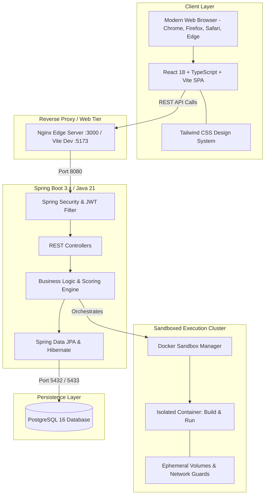

# Architecture Design Document
## Project: ProjectEval — Automated Project Evaluation & Testing Platform

### 1. High-Level System Architecture



---

### 2. Docker Sandbox Isolation Architecture

Executing user-provided code introduces significant security hazards. ProjectEval enforces a zero-trust model:

```
Uploaded Project (GitHub URL or ZIP)
           │
           ▼
[Security Gate: ZIP Slip Sanitization]
           │
           ▼
[Ephemeral Staging Directory]
           │
           ▼
[Docker Container Isolation]
 ├── Non-root runtime user
 ├── Resource Quota: 512MB RAM, 1.0 vCPU
 ├── Execution Timeout: 120 seconds hard kill
 ├── Read-only host filesystem mount
 └── Blocked access to host docker socket
           │
           ▼
[Automated Test Probes: Build, Startup, API, UI, DB, Sec]
           │
           ▼
[Teardown: Recursive Cleanup of Container & Temporary Volumes]
```

---

### 3. Frontend Architecture

The frontend follows an accessible, modular structure:
```
frontend/src/
├── components/        # Reusable UI widgets (Scorecard, Badges, Navbar, Sidebar)
├── context/           # State providers (AuthContext, Notifications)
├── pages/             # Route views segregated by domain:
│   ├── auth/          # Login, Register
│   ├── admin/         # Dashboard, Projects, Students, Evaluators, Settings, Audits
│   ├── student/       # Dashboard, Submit, MyProjects, ProjectDetails
│   └── evaluator/     # Dashboard, EvaluateWorkspace
├── services/          # Axios HTTP clients and interceptors
└── types/             # TypeScript interfaces matching backend models
```
