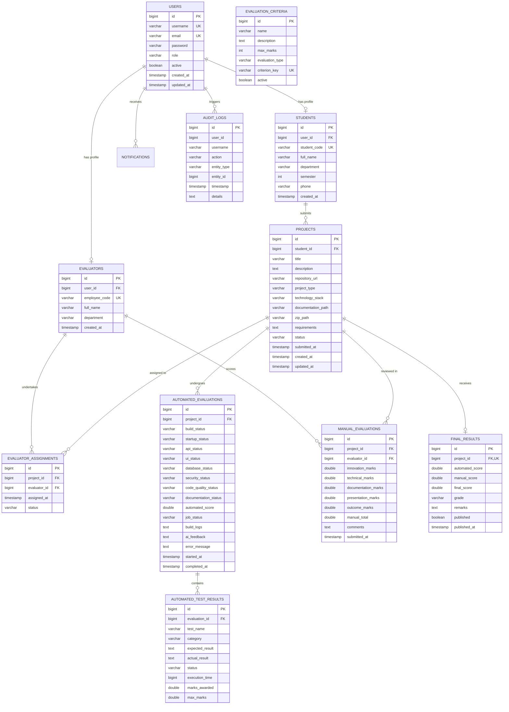

# Database Design & Schema Reference
## Project: ProjectEval — Automated Project Evaluation & Testing Platform

### 1. Entity Relationship Diagram (ERD)

---

### 2. Indexes and Foreign Key Constraints

1. **`users`**: Unique constraint on `username` and `email`.
2. **`students`**: Foreign key to `users(id)`, unique index on `student_code`.
3. **`evaluators`**: Foreign key to `users(id)`, unique index on `employee_code`.
4. **`projects`**: Foreign key to `students(id)`, index on `status`.
5. **`evaluator_assignments`**: Foreign keys to `projects(id)` and `evaluators(id)`.
6. **`automated_evaluations`**: Foreign key to `projects(id)`.
7. **`automated_test_results`**: Foreign key to `automated_evaluations(id)` with cascading delete.
8. **`manual_evaluations`**: Foreign keys to `projects(id)` and `evaluators(id)`.
9. **`final_results`**: Unique foreign key to `projects(id)`.
10. **`audit_logs`**: Ordered timestamp index for high performance descending pagination.
