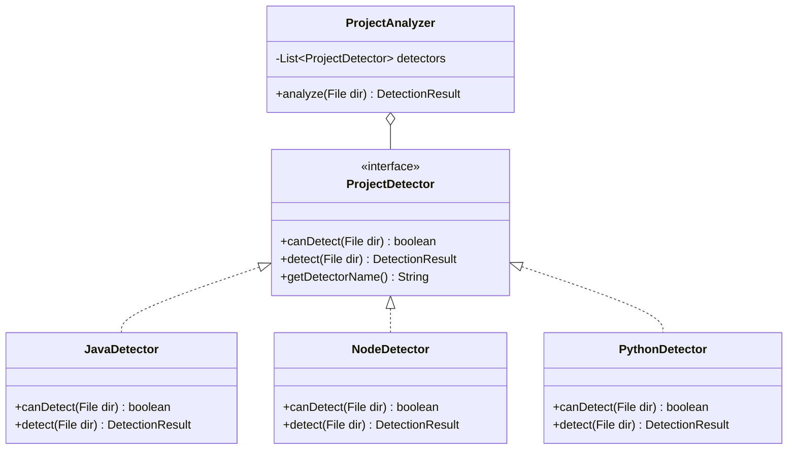
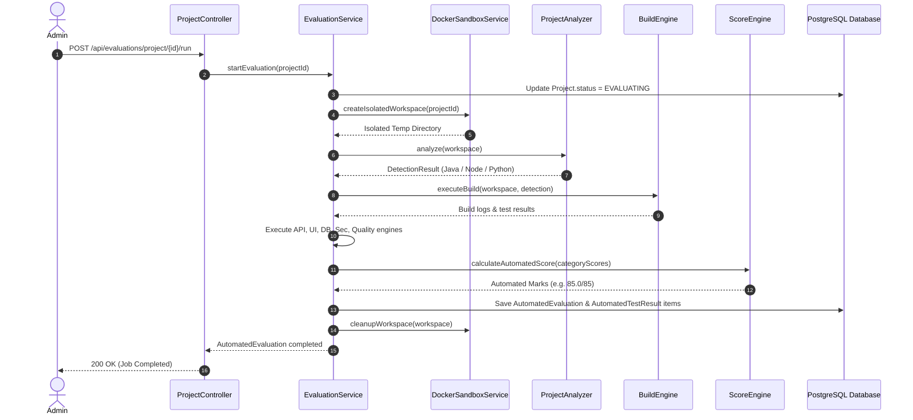

# Low-Level Design (LLD)
## Project: ProjectEval — Automated Project Evaluation & Testing Platform

### 1. Architectural Overview & Design Patterns

The backend follows a strict **Layered Enterprise Architecture**:
```
Client (React SPA)
       │ HTTP/REST (JSON / Multipart / Binary PDF)
       ▼
Controllers (Auth, Project, Evaluation, Report, Dashboard, User, Config, Audit)
       │
       ▼
Services (Business logic, orchestration, validation, security)
       ├── ProjectAnalyzer (Strategy Pattern with JavaDetector, NodeDetector, PythonDetector)
       ├── Execution Engines (BuildEngine, StartupEngine, ApiEngine, UiEngine, DatabaseEngine)
       ├── ScoringEngine (Pure math calculations and boundary mapping)
       ├── DockerSandboxService (Isolates runtime environments)
       └── ReportService (Binary PDF streaming via OpenPDF)
       │
       ▼
Repositories (Spring Data JPA interfaces with derived and custom queries)
       │
       ▼
PostgreSQL Relational Storage
```

---

### 2. Strategy Pattern: Pluggable Project Detection



---

### 3. Core Class Design & Model Relationships

#### 3.1 Entity Model
- **User:** Primary identity record storing hashed passwords and role authorizations.
- **Student & Evaluator:** Profiles linked via `OneToOne` relationships with User.
- **Project:** Tracks lifecycle states (`DRAFT`, `SUBMITTED`, `ASSIGNED`, `EVALUATING`, `EVALUATED`, `APPROVED`, `REJECTED`).
- **EvaluatorAssignment:** Many-to-one mapping assigning a faculty member to a project.
- **AutomatedEvaluation:** Holds job status (`QUEUED`, `RUNNING`, `BUILDING`, `STARTING`, `TESTING`, `ANALYZING`, `COMPLETED`), aggregate score, build logs, and AI feedback.
- **AutomatedTestResult:** Detailed granular test item linked to `AutomatedEvaluation`.
- **ManualEvaluation:** Records faculty marks (Innovation, Technical, Documentation, Presentation, Outcome) and qualitative feedback.
- **FinalResult:** Combines automated (85) and manual (15) scores to output grade and publication state.

---

### 4. Sequence Diagram: Automated Evaluation Workflow



---

### 5. Security Architecture (JWT & Filters)

1. **JwtAuthenticationFilter:**
   - Intercepts incoming HTTP requests.
   - Parses the `Authorization: Bearer <token>` header.
   - Validates HMAC signature using SHA-256 secret key.
   - Populates Spring's `SecurityContextHolder` with `UserPrincipal` and authorities.
2. **Global Exception Handling:**
   - `GlobalExceptionHandler` intercepts validation failures and security exceptions.
   - Transforms exceptions into uniform JSON payloads (`ApiResponse<T>`).
   - Prevents stack trace leakages in compliance with OWASP Top 10 guidelines.
